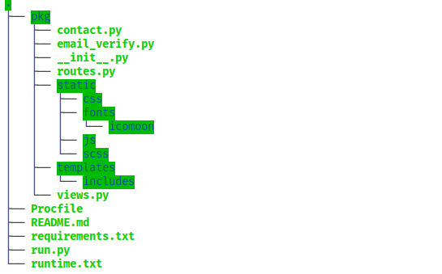

# iSOLveIT
*A portfolio website hosted with Heroku*

## Installation
* First you have to get [Python](https://www.python.org/) installed on your computer.

* Create a new directory
* Open the directory in a terminal, then enter the command `git init .`
* Enter the command `git clone https://github.com/iSOLveIT/Personal-Site.git`

* Install all dependencies in the requirements.txt file by using command `pip install -r requirements.txt`

## How to run the app
#### Using the Flask WSGI_server
* In order to run the app, open the directory in a terminal, then enter the command `python3 run.py` 

#### Using the Gunicorn_server
* To run the app, open the directory in a terminal, then enter the command `gunicorn -w 3 -b "127.0.0.1:4000" run:app`

* NOTE: 
    * If you intend using this project in the productive environment do not use the development server.
    * Make sure `debug=True` is cleared in a productive environment
	* In a productive environment make sure `threaded=True` is used only if your server can handle threading. Else it is better to clear it

## What does the app achieve?
* The app is a single page app that gives information about a developer's coding skills, personality, achievements and contact details 

## How the app was designed?
* The app was designed with the Python web framework called Flask. 
* The app was designed as a package to make the code maintainable.
* The app used the Django MVC architecture by having a different files for holding both the views (views.py) and routes (routes.py in Django known as url.py)
* The app uses an email verification API to verify the emails sent through the contact form
* The app uses Flask-Compress to compress static files

## Directory Structure

## Preview Link
[iSOLveIT](https://isolveit.herokuapp.com)

## Author
* __Duodu Randy :octocat:__

### Date Created
* _Thursday, 5th September, 2019_
